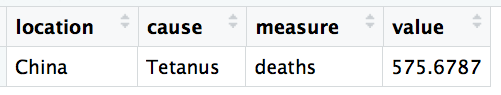

# Activity 1
In this first activity, we'll explore the following data on the **disease burden** of hundreds of diseases in each country. The data was produced by the [Institute for Health Metrics and Evaluation](http://www.healthdata.org/), and was downloaded using [this configuration](http://ghdx.healthdata.org/gbd-results-tool?params=gbd-api-2017-permalink/0189892a8089f3da20631f8f0f95eb53) on their [Global Health Data Exchange](http://ghdx.healthdata.org/) data download tool (minor changes have been made to the column names and value labels after downloading). The data contains the following columns:

- **country**: The country of interest
- **cause**: The disease (or injury) of interest
- **measure**: The way of assessing the "burden" a cause has on a country, including:
    - _deaths_: The number of people who have died from a given cause
    - _prevalence_: The number of people living with a disease or injury
    - _ylls_: The years of life lost attributable to a cause
    - _ylds_: The total number of years lived in sub-optimal health due to a cause
    - _dalys_: The total burden attributable to the cause, including disability experienced and premature death (ylls + ylds)
- **value**: The burden (as measured by the `measure`) attributable to the `cause` in a given `location`.

For example -- the following row could be read as:

> It is estimated that 576 people died of Tetanus in China.

Open the `analysis.R` file for guided data exploration instructions.