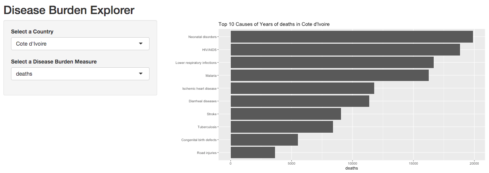

# Activity 2
In this activity, we'll build an interactive [Shiny Application](https://shiny.rstudio.com/) to allow users to visually explore their data. The final product will allow users to select a _country_ and _measure_ of interest, and view a graph of the results. Your final product should look like this:

Open the `app.R` file for instructions.